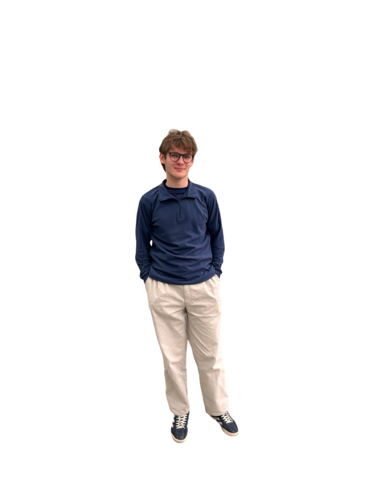
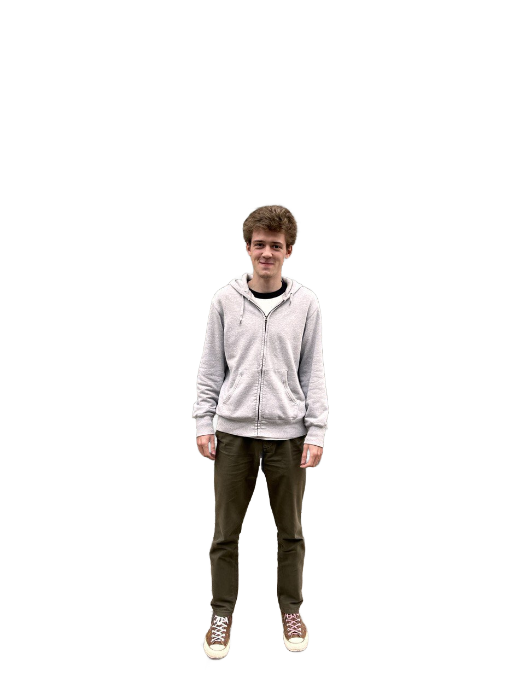

# BIT-AI-DM-Project

Fashion Evaluation AI: Judging Fashionable Clothing Based on Popular Fashion Show Trends

保罗 (ID: 1820249041)

伊力亚 (ID: 1820249057)

叶歌 (ID: 1820249066)

## **1. Introduction - Motivation**
In our world, appearance plays a crucial role in how others perceive us; it’s not for nothing that they say, "Clothes make the man". Dressing well can positively influence various aspects of life, from personal relationships and career opportunities to self-confidence. However, staying updated with ever-changing fashion trends requires effort and knowledge—not everyone has the time or ability to keep up. By leveraging artificial intelligence, we aim to create a model that objectively assesses how "fashionable" an outfit appears, using images based on popular fashion show trends. Our AI project seeks to bring an objective perspective to fashion evaluation, potentially benefiting style consultants, online fashion retailers, social media influencers and of course ordinary people who want to dress fashionably!

**2. Problem Definition**

The problem is to develop a model that evaluates the fashionability of clothing items in photos by classifying them as trendy (marked with a "fashion" prefix) or non-trendy. This classification must be consistent, accurate, and reflective of current fashion trends based on a dataset from popular fashion shows. While fashion inherently carries an element of subjectivity, we aim to provide an objective assessment by leveraging the judgments of fashion industry professionals who influence these shows. To support fairness and inclusivity, the dataset includes individuals from various nationalities, helping the model generalize across diverse cultural backgrounds and provide a balanced evaluation of global fashion trends.

**3. Proposed Method**
## **Intuition**
Our AI model offers a unique approach to evaluating fashionability, standing out in a market with few direct competitors. By leveraging data from diverse fashion shows and including people of various nationalities in our dataset, our model aims to provide a culturally inclusive and globally relevant fashion evaluation, which is rare in existing solutions. Furthermore, by releasing the project as open-source, we invite contributions from a wide community, fostering continual improvement and adaptation to evolving fashion trends. This collaborative approach positions our model to set a new standard in fashion assessment, consistently enhancing its accuracy and relevance over time.

**Description of Algorithms**

1. **Data Collection and Preprocessing**
   1. **Data Sources:** Opensource datasets on clothing, fashion, images from various fashion shows, as well as photos of people in “plain” clothing.
   1. **Preprocessing:** Images were all decoded into jpeg-fromat. resized and normalized (all of the photos in the dataset have background removed) for robustness.
1. **Model Architecture**
1. **Input Layer**:
   1. The model takes input images of shape (256, 256, 3), indicating RGB images with a height and width of 256 pixels.
1. **Convolutional Layers**:
   1. The model consists of three convolutional layers:
      1. **Conv2D Layer 1**: 32 filters, kernel size of (3, 3), ReLU activation.
      1. **Conv2D Layer 2**: 64 filters, kernel size of (3, 3), ReLU activation.
      1. **Conv2D Layer 3**: 128 filters, kernel size of (3, 3), ReLU activation.
   1. Each convolutional layer is followed by a max pooling layer, which reduces the spatial dimensions of the feature maps by a factor of 2, helping to down-sample the data and reduce computational complexity.
1. **Flatten Layer**:
   1. After the convolutional layers, the output is flattened into a 1D vector to prepare for the fully connected layers.
1. **Output Layers**:
   1. **Class Output**: A dense layer with num\_classes (set to 58) neurons and a softmax activation function, producing class probabilities for multi-class classification.
   1. **Bounding Box Output**: A separate dense layer with 4 neurons and a linear activation function, predicting the coordinates of bounding boxes (likely in the format [x\_min, y\_min, x\_max, y\_max]).
1. **Model Compilation**

   The model is compiled with:

   1. **Optimizer**: Adam optimizer, which adapts the learning rate during training.
   1. **Loss Functions**:
      1. For classification: Sparse categorical cross-entropy, suitable for integer labels.
      1. For bounding box regression: Mean squared error, measuring the average squared difference between predicted and true values.
   1. **Metrics**:
      1. For bounding box regression: Mean absolute error, providing insight into the average error in bounding box predictions.

1. **Dataset Labeling**
   1. Dataset comprises of photos from fashion shows and people in plain clothing. It was manually mined and labeled (photos from shows have prefix “fashion\_” with the type of cloth and photos with ordinary clothing have none).

1. **Image Processing:**

   Images were all resized to be 256 x 256 pixels, RGB and .jpg format. Since images were labelled using rectangle box-bounding, meaning that most of the time other objects can be bounded apart from those that we want, at all images background was removed using remgb python library to ensure model best learning rate.

**4. Experiment**

**Testbed and Experimental Questions**

- Testbed: Image dataset including fashion show photos and common dressed people with labeled clothing items.
- Key Question:
  - Defining method to distinguish fashionability

**Experiment Results**

|**Item** *(top-5 classified as the most probable)*|**Probability** *(%; was normalized to match the scale from 0 to 100)* |
| :- | :- |
|Common\_Trousers|**20.81**|
|Common\_Shirt|**19.9**|
|Common\_Boots|**19.86**|
|Common\_Sweater|**19.76**|
|Common\_Sneakers|**19.66**|

|**Item** *(top-5 classified as the most probable)*|**Probability** *(%; was normalized to match the scale from 0 to 100)* |
| :- | :- |
|Common\_Shorts|**20.15**|
|Common\_Tank top|**20.06**|
|Common\_Jeans|**20.00**|
|Common\_Sneakers|**19.9**|
|Common\_Cardigan|**19.89**|

**Details of the Experiment & Observations**

Since the topic of fashion solely depends on human perception, it is impossible to universally say if the model gives the correct output. Based on the given results, the model performs well at defining casually dressed men and fashionably dressed women.

Furthermore, datasets between fashionable and non-fashionable do not have so many distinct features, so on average we get clothing items classified as common. Concerning the datatset, we can say that our model performed better with the non-transparent one.

**5. Discussion and Conclusion**

**Factors influencing outcome**

\- Size of the dataset: there are approximately 250 photos used for training of the model, as the process is very tedious and time-consuming. Moreover, there is a significant lack of datasets on the given topic: our dataset has been mined manually by gathering photos from the latest fashion shows and across opensources, providing stock image of people in clothing.

\- Properties of images: all of them have been gathered from different sources, meaning they have been taken using diffrent equipment, which straight-forwardly affects their quality. Futhermore, despite being all normalized to the resolution 256 by 256, another key factor is positioning of object on the given photo, which can severe results.

\- Relativity of fashion comprehension: it is a human-made concept, which is percieved based on cultural context, subjective interpretation and temporal dynamics.

**Conclusion**

Our model effectively evaluates the fashionability of clothing items on the photo by leveraging our processed dataset, consisting of photos from fashion shows and people in common “untrendy” clothing. The limitations of our model include heavy dependency on the dataset size and people biased perception of fashion, as well as performance dependence on image quality and potential gaps in trend definition.

By releasing this project as open-source, we aim to foster community-driven improvements and allow it to be continuously updated with new data and techniques, ensuring relevance to evolving fashion trends.
